# 🚚 FIRST ROAD

  

    

  🔗 <a href="https://github.com/cjc0623/Real_Pro">GitHub Repository 바로가기</a>

 

---

## 📌 프로젝트 정보

| 항목 | 내용 |
|------|------|
| 프로젝트명 | FIRST ROAD |
| 개발 기간 | 2026.04 ~ 2026.05 |
| 개발 인원 | 5명 |
| 기술 스택 | Spring Boot, React, MariaDB |
| 한 줄 소개 | 화물 운송 중개 플랫폼 (화주 ↔ 차주 매칭 서비스) |

---

## 👥 팀 소개

| 이름 | GitHub |
|------|--------|
| 김기현 | [GitHub](https://github.com/Kimkihyun-ui) |
| 김우근 | [GitHub](https://github.com/k-keun) |
| 서준원 | [GitHub](https://github.com/tjwnsdnjs3) |
| 최현민 | [GitHub](https://github.com/cjc0623) |
| 하승준 | [GitHub](https://github.com/Ha-SeungJun) |

---

## 📖 프로젝트 소개

FIRST ROAD는 화주와 차주를 연결해주는  
**화물 운송 중개 플랫폼**입니다.

- 화주는 화물을 등록하고
- 차주는 등록된 화물을 확인한 뒤 운송을 수락하며
- 최종적으로 차주와 매칭을 통해 배송이 이루어집니다.

Spring Boot 기반 REST API 서버로 구현되었으며,  
React 프론트엔드와 연동됩니다.

---

## 🌐 배포 주소

- 🔗 Frontend: https://first-road.vercel.app 
- 🔗 Backend: API 서버 연동 완료  

---

## 🖥 화면 구성

### 🔹 메인 페이지

<table>
  <tr>
    <td></td>
    <td>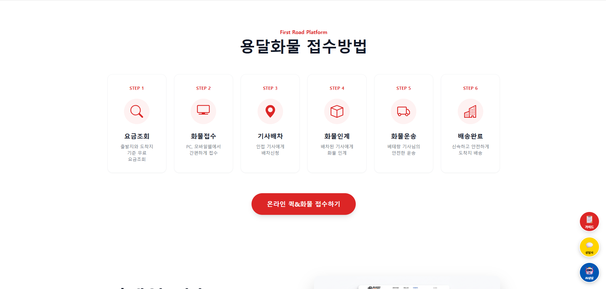</td>
  </tr>
  <tr>
    <td>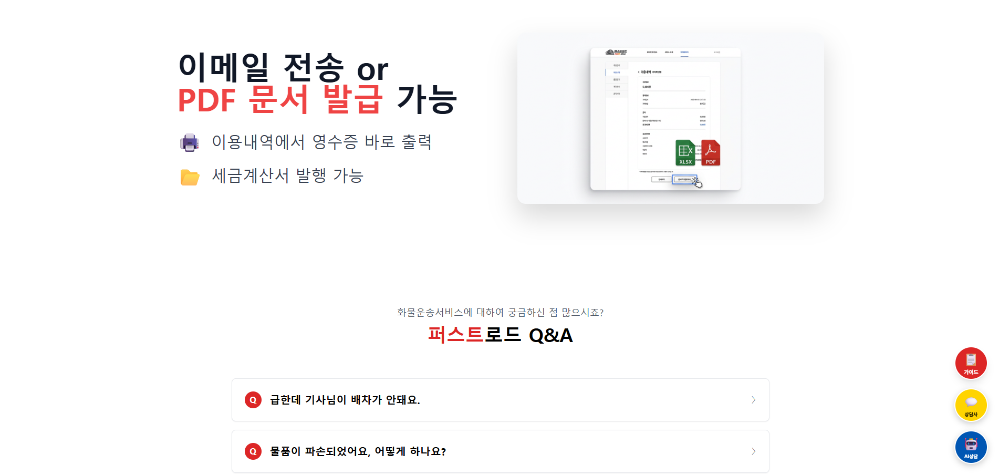</td>
    <td>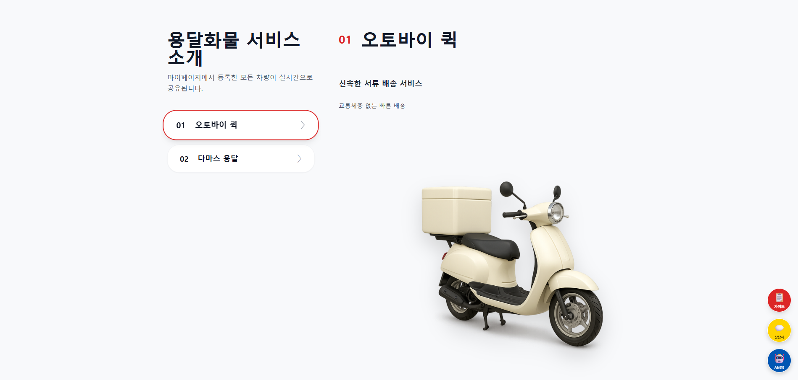</td>
  </tr>
</table>

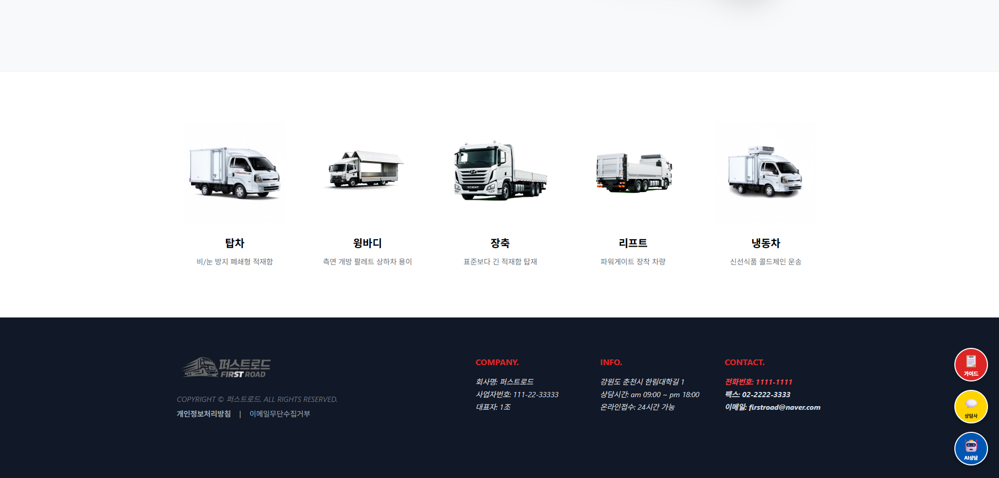

### 🔹 로그인 / 회원가입

<table>
  <tr>
    <td>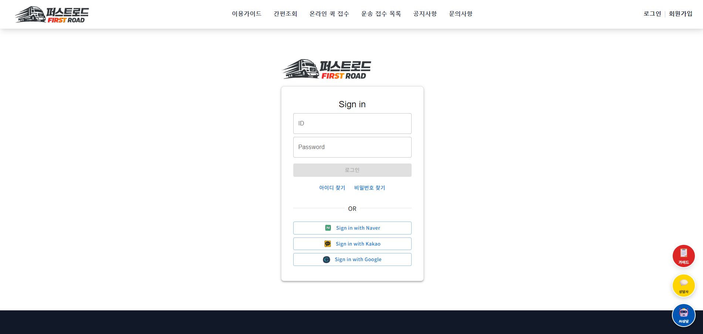</td>
    <td>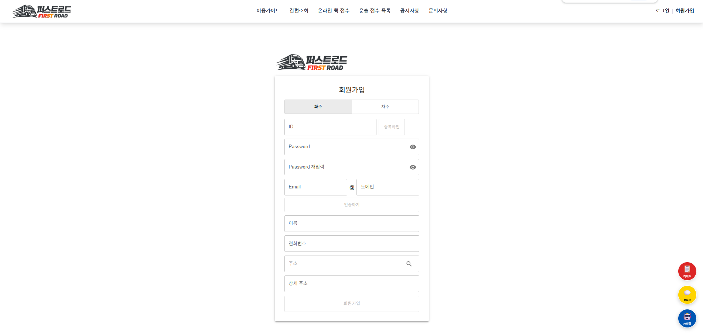</td>
  </tr>
</table>

### 🔹 이용가이드
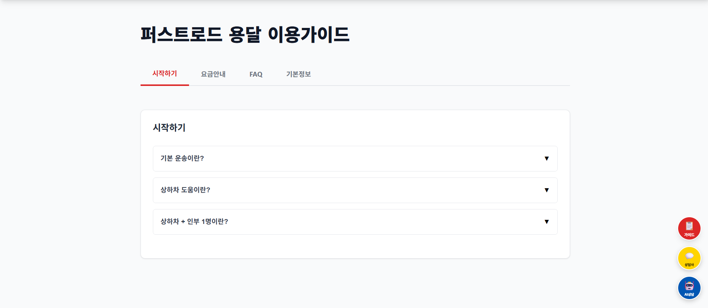

### 🔹 간편조회
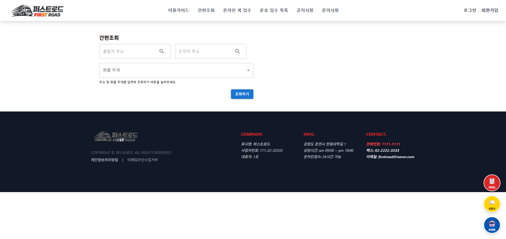

### 🔹 화물 등록
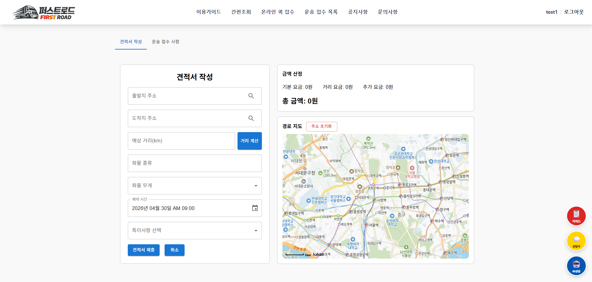

### 🔹 운송 접수 목록
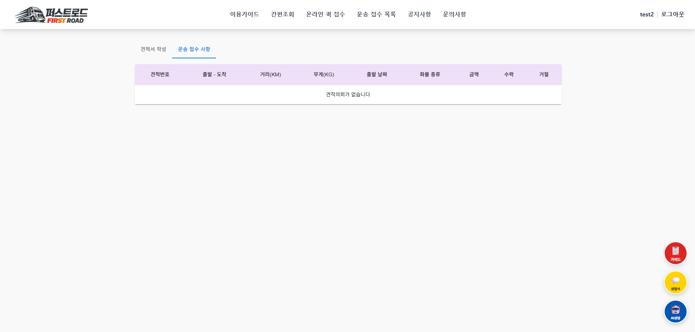

### 🔹 공지사항
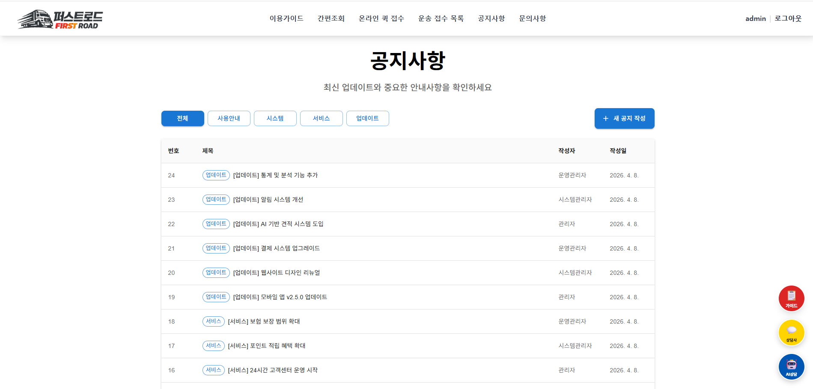

### 🔹 문의사항
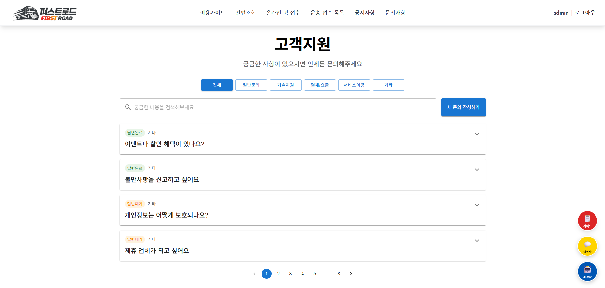

### 🔹 마이페이지

<table>
  <tr>
    <td>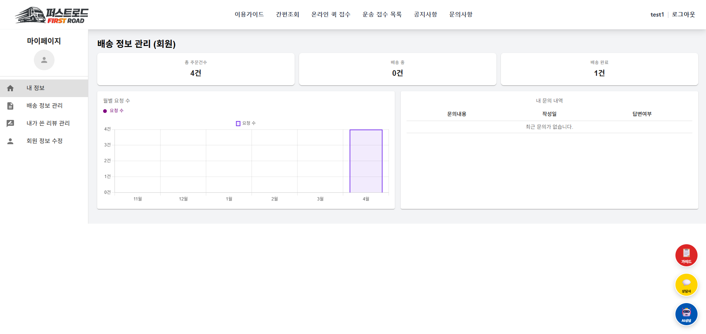</td>
    <td>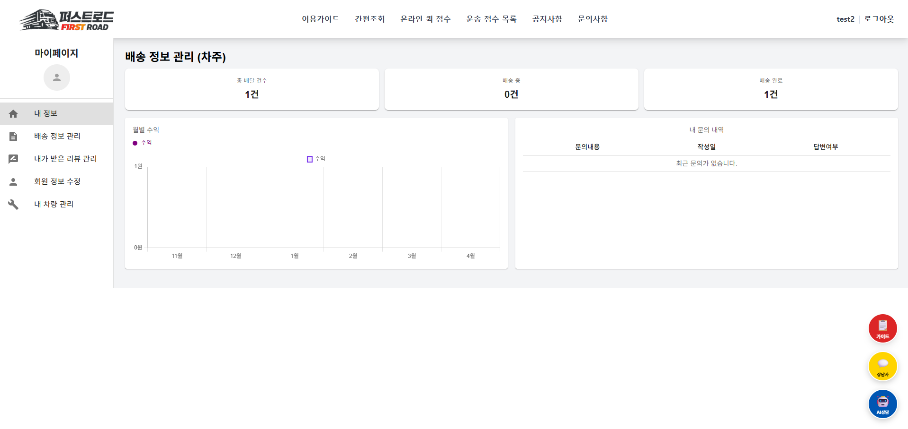</td>
  </tr>
  <tr>
    <td>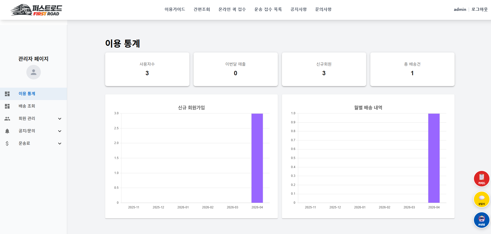</td>
    <td></td>
  </tr>
</table>

---

## ✨ 주요 기능

### 🔐 1. 회원 관리
- 회원가입 / 로그인 기능 제공
- SNS 계정을 통한 간편 로그인 지원
- 회원 프로필 사진 업로드 기능 제공
- 프로필 기반 사용자 신뢰도 향상
- JWT 기반 인증 처리
- 사용자 권한별 접근 제어

##### 1-1 화주 대시보드
- 총 주문 건수 확인
- 배송중 / 배송완료 건수 확인
- 월별 요청 수 그래프 제공
- 내 문의내역 조회 가능

##### 1-2 차주 대시보드
- 총 배달 건수 확인
- 배송중 / 배송완료 건수 확인
- 월별 수익 그래프 제공
- 내 문의내역 조회 가능

##### 1-3 관리자 대시보드
- 전체 회원, 신규 회원, 매출 통계 제공
- 총 배송 건수 확인
- 회원, 화물, 신고, 게시판 통합 관리 기능 제공
- 신고 처리 및 사용자 제재 기능
- 요금 설정 기능 제공
  
---

### 2. 게시판

- 공지사항, 이용가이드, 문의 게시판 제공
- 진행 설차 설명 및 FAQ 제공
- 차주, 화주 : 문의 기능 제공
- 관리자 : 공지사항 등록 및 문의 응답 기능 제공
- 문의 내역 조회 제공
---

### 💬 3. 상담 서비스

- 상담사와 AI 상담사 기능 제공
- 자주 묻는 질문에 대한 AI 기반 자동 응답 ( 상담사 ai 전부 매크로 답변...) 
- AI를 통한 빠른 문의처리 제공
- 주요 내용 상담사에게 문의 가능
- 화물 등록, 운송 수락, 결제, 배송 관련 상담 지원
- 사용자 문의 응대 및 서비스 이용 편의성 향상

---

### 🚛 4. 화물 등록
- 화주가 화물 정보 등록 가능
- 출발지 / 도착지 / 무게 / 상세 정보 입력
- 지도 기반 출발지·도착지 확인 가능
- 등록된 화물 위치를 한눈에 확인 가능
- 지도 클릭을 통한 직관적인 출발지·도착지 주소 지정 기능
- 거리 기반 운송 가격 계산 기능 제공

---

### 🤝 5. 운송 수락 시스템
- 등록된 화물을 차주가 직접 확인 후 수락
- 화주와 차주를 연결하는 매칭 구조 제공
- 수락 완료 시 배송 프로세스 진행

---

### 💸 6. 결제 및 할인 시스템
- 견적수 수락 후 결제 처리 기능 제공
- 화주 ↔ 차주 간 정산 자동 처리
- 운송 거리별 할인 적용
  - 100km 이상 : 5% 할인
  - 200km 이상 : 10% 할인
  - 300km 이상 : 15% 할인
  - 400km 이상 : 20% 할인
- 할인 쿠폰 등록 및 적용 기능 제공
- 최종 운송 비용 자동 계산 지원
- 할인 쿠폰 등록 및 적용 기능 제공
- 거래 내역 및 결제 기록 조회 가능
- 안전한 거래를 위한 결제 프로세스 지원

---

### 📦 7. 배송 관리
- 배송 상태 조회 (대기 / 진행 / 완료)
- 배송 흐름 관리

---

### ⭐,🚨 8. 리뷰 및 신고 시스템
- 안전한 거래를 위한 리뷰 및 신고 시스템 적용
- 운송 완료 후 화주와 차주 간 리뷰 작성
- 평점 및 후기 기반 신뢰도 관리
- 리뷰 썸네일 이미지 기능 적용
- 리뷰 감성 분석 기반 신뢰도 점수 시스템 구현
- 부적절한 사용자 또는 거래 신고, 정 가능
- 신고 내역 기반 관리자 검토 가능

---

## ✨ 1. 서브 기능 
- 차주 프로필 및 신뢰도 분석 시스템
  - 리뷰 및 배송 데이터를 기반으로 차주의 신뢰도를 분석하고 시각화하는 기능
  - 차주 프로필 카드 UI 제공
  - 평균 평점 및 리뷰 통계 제공
  - 차주 본인 인증 기능 제공 (포트원 API 기반)
  - 리뷰 기반 차주 신뢰도 점수 계산
  - 리뷰 감성 분석 기반 신뢰도 시스템 구현
  - 신뢰도 점수 시각화 UI 제공

---

## ✨ 2. 서브 기능

- 주문서 인쇄 및 PDF 저장 기능
- 반응형 UI 적용으로 모바일 사용 가능
- 입력 패턴 및 유효성 검사 추가 

---

## 🛠 기술 스택

### Backend

### Frontend

### Database

---

## 📌 향후 개선 사항

- [ ] Swagger를 활용한 API 문서 자동화
- [ ] 화물 수락, 배송 상태 변경, 문의 답변에 대한 알림 시스템 구현
- [ ] 위치 기반 실시간 운송 매칭 기능 고도화
- [ ] 운송 이력 기반 차주 추천 기능 추가
